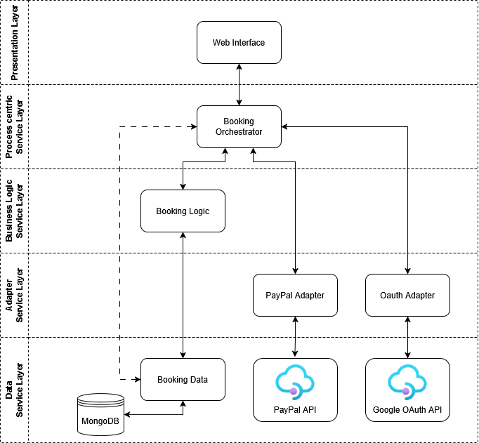
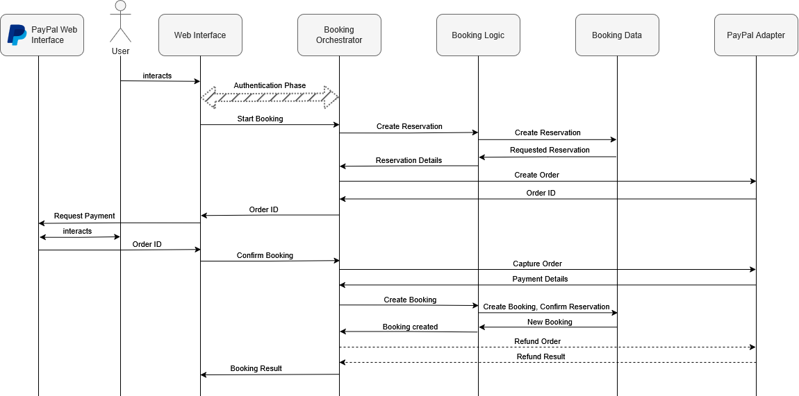

# Course Booking System

A microservices-based course booking platform with PayPal payment integration and Google OAuth authentication. The system allows users to browse courses, make reservations, and complete bookings with integrated payment processing.

[](https://pietro-farina.github.io/sde_project/api-docs.html)

## 📋 Table of Contents

- [Architecture](#architecture)
- [Tech Stack](#tech-stack)
- [API Documentation](#api-documentation)
- [Prerequisites](#prerequisites)
- [Getting Started](#getting-started)
- [Project Structure](#project-structure)
- [Services Overview](#services-overview)
- [Environment Configuration](#environment-configuration)
- [Running the Application](#running-the-application)

## Architecture

The system follows a microservices architecture with clear separation of concerns across multiple layers:

### System Architecture



The application is organized into the following layers:
- **Presentation Layer**: Web Interface (React + Vite)
- **Process Center Service Layer**: Booking Orchestrator
- **Business Layer**: Booking Logic
- **Adapter Service Layer**: PayPal Adapter, OAuth Adapter
- **Data Service Layer**: Booking Data (MongoDB)

### Payment Flow



The booking and payment process involves:
1. User authentication via Google OAuth
2. Reservation creation in Booking Logic
3. PayPal order creation and payment processing
4. Booking confirmation and finalizaion of reservation
5. Automatically refund if payment succeed and booking confirmation fail

## Tech Stack

### Frontend
- **React 18** - UI framework
- **Vite** - Build tool and dev server
- **Redux Toolkit** - State management
- **Antd** - Component library
- **PayPal JS SDK** - Payment integration

### Backend
- **Node.js** - Runtime environment
- **Express.js** - Web framework
- **MongoDB** - Database
- **Mongoose** - ODM
- **Passport.js** - Authentication
- **Axios** - HTTP client

### Infrastructure
- **Docker & Docker Compose** - Containerization
- **Swagger/OpenAPI** - API documentation
- **Cron** - Scheduled tasks

## API Documentation

The combined documentation can be read by clicking [here](https://pietro-farina.github.io/sde_project/api-docs.html).

Alternatively, each service exposes OpenAPI/Swagger documentation:
- **Booking Orchestrator**: http://localhost:3000/api-docs
- **Booking Logic**: http://localhost:3001/api-docs
- **Booking Data**: http://localhost:3002/api-docs
- **OAuth Adapter**: http://localhost:3003/api-docs
- **PayPal Adapter**: http://localhost:3004/api-docs


## Prerequisites

Before you begin, ensure you have the following installed:
- **Node.js** (v18 or higher)
- **Docker** and **Docker Compose**
- **MongoDB**
- **Git**

## Getting Started

### 1. Clone the Repository

```bash
git clone <repository-url>
cd sde
```

### 2. Environment Setup

Each service requires its own environment configuration. Copy the example files and configure them.

See [Environment Configuration](#environment-configuration) for detailed setup.

### 3. Install Dependencies

#### Using Docker

```bash
docker-compose up --build
```

## Project Structure

```
sde/
├── backend/
│   ├── booking-orchestrator/    # Main orchestration service
│   ├── booking-logic/           # Business logic for reservations
│   ├── booking-data/            # Data persistence service
│   ├── oauth-adapter/           # Google OAuth integration
│   ├── paypal-adapter/          # PayPal payment integration
│   └── booking-cleanup-cron/    # Automated cleanup tasks
├── frontend/                    # React web application
├── api-docs/                    # API documentation service
├── docker-compose.yml           # Production Docker configuration
├── docker-compose.dev.yml       # Development Docker configuration
└── README.md
```

## Services Overview

### Booking Orchestrator
**Port**: 3000

The main entry point for the application. Handles:
- API Gateway
- Request routing to appropriate services
- Orchestrate different services
- Authentication and authorization (JWT)

### Booking Logic
**Port**: 3001

Business logic service responsible for:
- Reservation creation and validation
- Booking confirmation
- Integration with data service
- Payment order creation

### Booking Data
**Port**: 3002

Data persistence layer providing:
- CRUD operations for bookings and reservations
- MongoDB integration
- Data models and schemas
- Cleanup settings

### PayPal Adapter
**Port**: 3003

Payment processing service for:
- PayPal order creation
- Payment capture
- Refund processing

### OAuth Adapter
**Port**: 3004

Authentication service handling:
- Google OAuth 2.0 integration
- User authentication flow

### Booking Cleanup Cron

Scheduled service that:
- Removes expired reservations

### Frontend
**Port**: 5173 (dev)

React-based web interface featuring:
- Course browsing and selection
- Calendar-based booking
- PayPal payment integration
- User authentication
- Booking management

## Environment Configuration

### Backend Services

#### Booking Orchestrator
```env
PORT=3000
BUSINESS_SERVICE_URL=http://booking-logic:3001
DATA_SERVICE_URL=http://data-service:3002
PAYPAL_ADAPTER_SERVICE_URL=http://paypal-adapter:3003

ENVIRONMENT=development
# --------- AUTHENTICATION SETTINGS --------- #
JWT_SECRET=your_jwt_secret
ACCESS_TTL_SECONDS=900
REFRESH_TTL_SECONDS=604800

# Public URL of adapter
OAUTH_ADAPTER_SERVICE_URL=http://oauth-adapter:3004

# Shared secret with adapter (same as adapter)
INTERNAL_ASSERTION_SECRET=super_shared_secret_between_services

# Frontend fallback redirect
FRONTEND_REDIRECT_URL=http://localhost:5173
# ------------------------------------------- #
```

#### Booking Logic
```env
PORT=3001
DATA_SERVICE_URL=http://booking-data:3002
```

#### Booking Data
```env
PORT=3002
DATABASE_URI=mongodb://mongodb:27017/access-example-booking-system
```

#### PayPal Adapter
```env
PORT=3003
PAYPAL_CLIENT_ID=your_paypal_client_id
PAYPAL_CLIENT_SECRET=your_paypal_client_secret
PAYPAL_MODE=sandbox
```

#### OAuth Adapter
```env
PORT=3004

GOOGLE_CLIENT_ID=your_google_client_id
GOOGLE_CLIENT_SECRET=your_google_client_secret
GOOGLE_CALLBACK_URL=http://localhost:3003/auth/google/callback

INTERNAL_ASSERTION_SECRET=super_shared_secret_between_services
ORCHESTRATOR_INTERNAL_ASSERT_URL=http://booking-orchestrator:3000/api/v1/auth/internal/assert
ORCHESTRATOR_COMPLETE_URL=http://localhost:3000/api/v1/auth/complete
FRONTEND_REDIRECT_URL=http://localhost:5173
```

### Frontend
```env
VITE_PAYPAL_CLIENT_ID=your_paypal_client_id
```

## Running the Application

### Development Mode

Using Docker Compose:
```bash
docker-compose -f docker-compose.dev.yml up
```

### Access the Application

- **Frontend**: http://localhost:5173 (dev) or http://localhost (prod)
- **Orchestrator API**: http://localhost:3000
- **API Documentation**: http://localhost:8080

## 🔍 Key Features

- ✅ **Google OAuth Authentication** - Secure user authentication
- ✅ **Course Browsing** - Browse available courses with detailed information
- ✅ **Calendar-based Booking** - Visual calendar interface for selecting time slots
- ✅ **Reservation System** - Temporary hold on slots with automatic cleanup
- ✅ **PayPal Integration** - Secure payment processing
- ✅ **Booking Management** - View and manage user bookings
- ✅ **Responsive Design** - Mobile-friendly interface
- ✅ **RESTful APIs** - Well-documented API endpoints
- ✅ **Microservices Architecture** - Scalable and maintainable design
